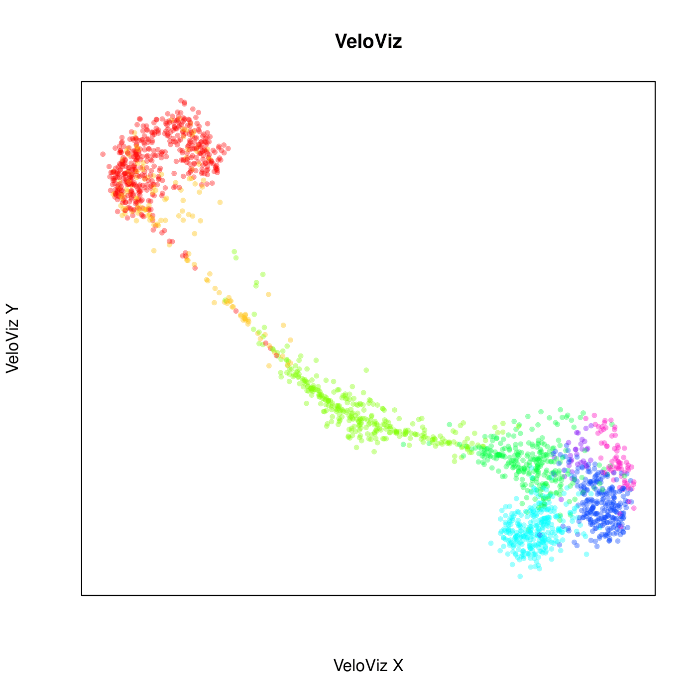
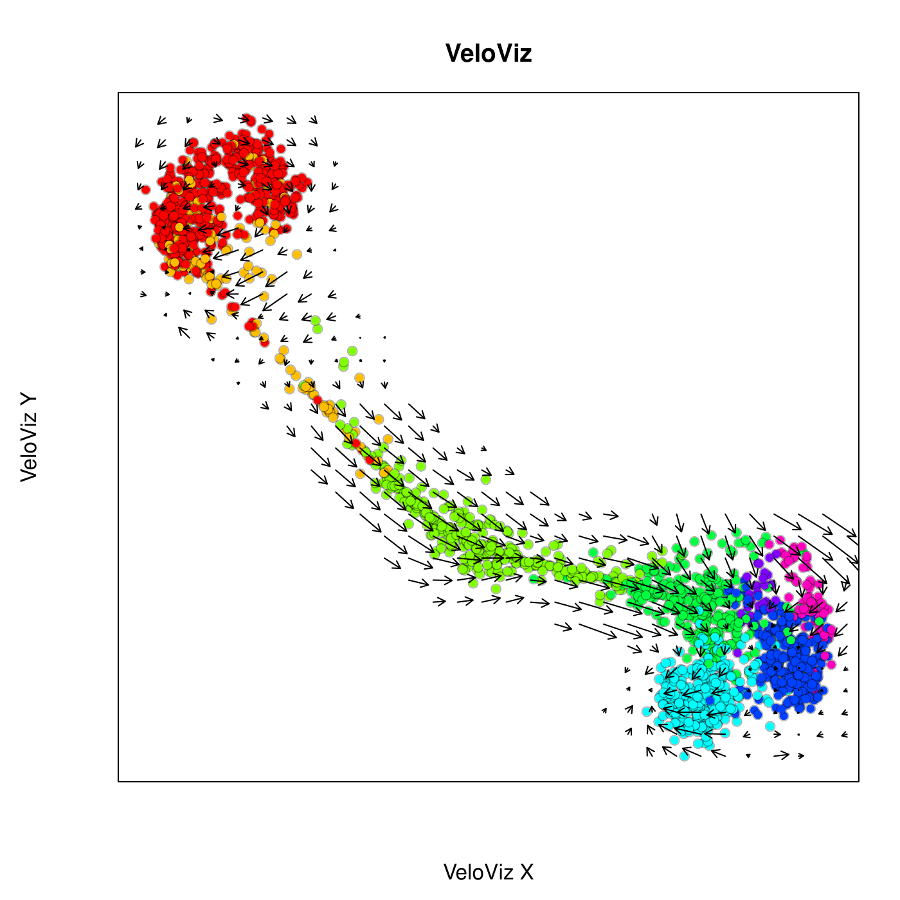
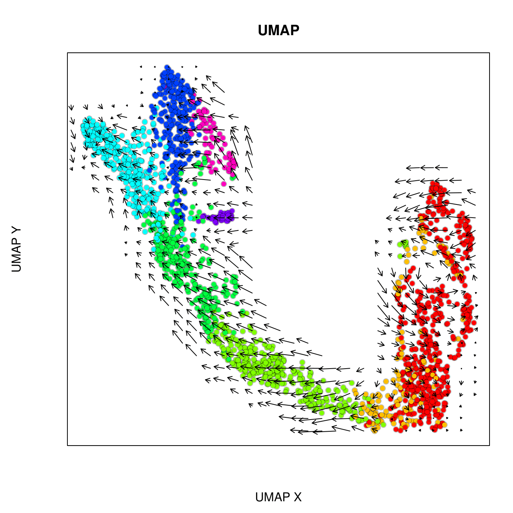
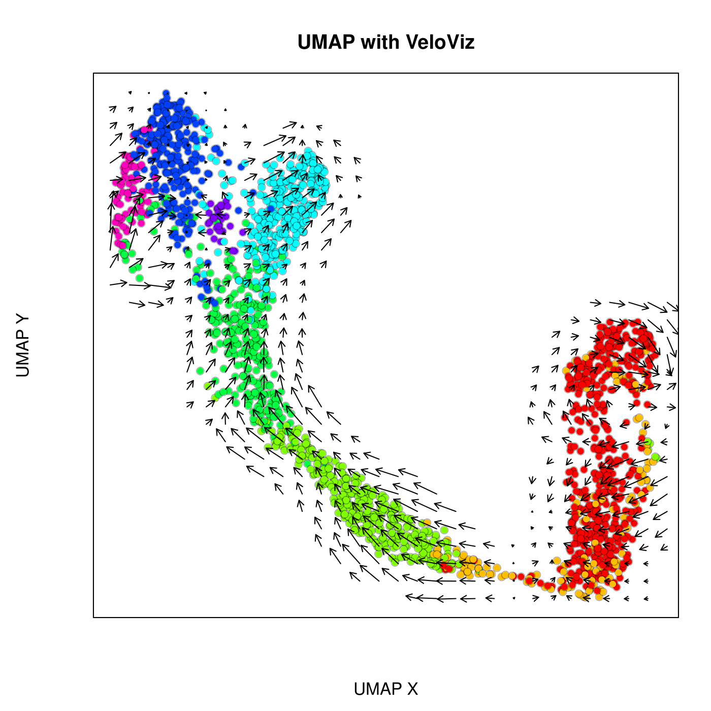

Inputting VeloViz nearest neighbors into UMAP
===========================

In this example, we will use Veloviz to produce a velocity-informed 2D
embedding and will then pass the computed nearest neighbor data into UMAP. 
This is useful to users who want to use common algorithms such as t-SNE and
UMAP, but with informed initialization. We will use the pancreas 
endocrinogenesis dataset in this example.

First, load libraries:

``` r 
library(reticulate)
library(veloviz)
library(velocyto.R)
```

Preprocessing
-------------

Inputs to VeloViz are the scores in PCA space of the current and
projected transcriptional states, which we get here by calculating RNA
velocity using velocyto.  
To get current and projected PC scores from raw counts, we first follow
standard filtering, normalization, and dimensional reduction steps and
then calculate velocity. 

0.) Get Data:

``` r
#getting pancreas data from scVelo
scv <- import("scvelo")
adata <- scv$datasets$pancreas()

#extract spliced, unspliced counts
spliced <- as.matrix(Matrix::t(adata$layers['spliced']))
unspliced <- as.matrix(Matrix::t(adata$layers['unspliced']))
cells <- adata$obs_names$values
genes <- adata$var_names$values
colnames(spliced) <- colnames(unspliced) <- cells
rownames(spliced) <- rownames(unspliced) <- genes

#clusters
clusters <- adata$obs$clusters
names(clusters) <- adata$obs_names$values

# subsample to make things faster
set.seed(0)
good.cells <- sample(cells, length(cells) / 2)
spliced <- spliced[,good.cells]
unspliced <- unspliced[,good.cells]
clusters <- clusters[good.cells]
```

1.) Filter good genes

``` r
#keep genes with >10 total counts
good.genes = genes[rowSums(spliced) > 10 & rowSums(unspliced) > 10]
spliced = spliced[good.genes,]
unspliced = unspliced[good.genes,]
```

2.) Normalize

``` r
counts = spliced + unspliced # use combined spliced and unspliced counts
cpm = normalizeDepth(counts) # normalize to counts per million
varnorm = normalizeVariance(cpm) # variance stabilize, find overdispersed genes
lognorm = log10(varnorm + 1) # log normalize
``` 

3.) Reduce Dimensions  
After filtering and normalizing, we reduce dimensions, and calculate
cell-cell distance in PC space. This distance will be used to compute
velocity.

``` r
#PCA on centered and scaled expression of overdispersed genes
pcs = reduceDimensions(lognorm, center = TRUE, scale = TRUE, nPCs = 50)

#cell distance in PC space
cell.dist = as.dist(1-cor(t(pcs))) 
``` 

Velocity
--------

4.) Calculate velocity  
Next, we compute velocity from spliced and unspliced counts and
cell-cell distances using velocyto. This will give us the current and
projected transcriptional states.

``` r
vel = gene.relative.velocity.estimates(spliced,
                                       unspliced,
                                       kCells = 30,
                                       cell.dist = cell.dist,
                                       fit.quantile = 0.1)
```

VeloViz
-------
5.) Build VeloViz graph from current and projected using `buildVeloviz`

``` r
# choose colors based on clusters for plotting later
cell.cols <- rainbow(8)[as.numeric(clusters)]
names(cell.cols) <- names(clusters)

curr = vel$current
proj = vel$projected

veloviz = buildVeloviz(
  curr = curr, 
  proj = proj,
  normalize.depth = TRUE,
  use.ods.genes = TRUE,
  alpha = 0.05,
  pca = TRUE,
  nPCs = 20,
  center = TRUE,
  scale = TRUE,
  k = 20,
  similarity.threshold = 0.25,
  distance.weight = 1,
  distance.threshold = 0.5,
  weighted = TRUE,
  seed = 0,
  verbose = FALSE
)

emb.veloviz = veloviz$fdg_coords
```

Perform UMAP on PCs
---------------------------
Here we will do UMAP as normal on the PC data.

``` r
# UMAP
set.seed(0)
emb.umap = uwot::umap(pcs, min_dist = 0.5)
rownames(emb.umap) <- rownames(pcs)
```

UMAP with VeloViz nearest neighbors
---------------------------
Now we want to input VeloViz-computed nearest neighbor data into UMAP. 
VeloViz outputs an igraph graph, but the uwot::umap function expects
NN data to formatted as a list of "idx" and "dist". So first we will
define a function to convert an igraph into the proper graph representation.

```r
library(igraph)

as_nn_graph = function(graph, k) {
  edges <- get.edgelist(graph) # array of [source, target] 
  weights <- E(graph)$weight # edge weights
  numEdges <- gsize(graph)
  numVertices <- gorder(graph)
  
  # array of [X, Neighbors(X)]
  idx <- matrix(nrow=numVertices, ncol=k+1) 
  
  # each row is distances from a vertex X to its neighbors
  dist <- matrix(0, nrow=numVertices, ncol=k+1)
  
  # replace NA values by saying a vertex X is a neighbor of itself 
  for (i in 1:numVertices) {
    idx[i,] <- i
  }
  
  for (i in 1:numEdges) {
    edge <- edges[i,] # edge = {source, target}
    source <- edge[1]
    target <- edge[2]
    
    # index of first "NA" value in row, after index 1
    index <- min(which(idx[source,] == source)[-1])
    
    idx[source, index] <- target
    dist[source, index] <- weights[i]
  }
  
  # construct & return a list consisting of two elements: "idx", "dist"
  nnGraph <- list()
  nnGraph$idx <- idx
  nnGraph$dist <- dist
  
  return(nnGraph)
}
```

Now we can input the NN graph from VeloViz into UMAP.

```r
# Convert veloviz$graph (igraph type) to an idx & dist representation
nnGraph <- as_nn_graph(graph = veloviz$graph, k = 20)

# input nnGraph to UMAP and plot
set.seed(0)
emb.umapVelo <- uwot::umap(X = NULL, nn_method = nnGraph, min_dist = 0.5)
rownames(emb.umapVelo) <- rownames(emb.veloviz)
```

Compare embeddings
---------------------------

```r
par(mfrow = c(1,3))

# VeloViz
plotEmbedding(emb.veloviz, 
              colors=cell.cols[rownames(emb.veloviz)],
              frame.plot = TRUE, xaxt = 'n', yaxt = 'n',
              main='VeloViz', xlab="VeloViz X", ylab = "VeloViz Y")

# UMAP on PC data
plotEmbedding(emb.umap, colors = cell.cols, main='UMAP',
              frame.plot = TRUE, xaxt = 'n', yaxt = 'n',
              xlab = "UMAP X", ylab = "UMAP Y")
              
# UMAP with VeloViz nearest neighbors
plotEmbedding(emb.umapVelo,
              colors = cell.cols[rownames(emb.umapVelo)],
              frame.plot = TRUE, xaxt = 'n', yaxt = 'n',
              main = 'UMAP with VeloViz', xlab = "UMAP X", ylab = "UMAP Y")
```

Veloviz                    |  UMAP                     |  UMAP with VeloViz
:-------------------------:|:-------------------------:|:-------------------------:
 |  |  

Now let’s project velocity inferred from `velocyto.R` onto these
embeddings.

```r
par(mfrow = c(1,3))

# show velocities
show.velocity.on.embedding.cor(scale(emb.veloviz), vel,
                               n = 50,
                               scale='sqrt',
                               cex=1, arrow.scale=1, show.grid.flow=TRUE,
                               min.grid.cell.mass=0.5, grid.n=30, arrow.lwd=1, do.par = F,
                               cell.colors=cell.cols[rownames(emb.veloviz)],
                               frame.plot = TRUE, xaxt = 'n', yaxt = 'n',
                               main='VeloViz', xlab="VeloViz X", ylab='VeloViz Y')

show.velocity.on.embedding.cor(scale(emb.umap), vel,
                               n = 50,
                               scale='sqrt',
                               cex=1, arrow.scale=1, show.grid.flow=TRUE,
                               min.grid.cell.mass=0.5, grid.n=30, arrow.lwd=1, do.par = F,
                               cell.colors=cell.cols,
                               frame.plot = TRUE, xaxt = 'n', yaxt = 'n'
                               main='UMAP', xlab="UMAP X", ylab='UMAP Y')

show.velocity.on.embedding.cor(scale(emb.umapVelo), vel,
                               n = 50,
                               scale='sqrt',
                               cex=1, arrow.scale=1, show.grid.flow=TRUE,
                               min.grid.cell.mass=0.5, grid.n=30, arrow.lwd=1, do.par = F,
                               cell.colors = cell.cols[rownames(emb.umapVelo)],
                               frame.plot = TRUE, xaxt = 'n', yaxt = 'n', 
                               main='UMAP with VeloViz', xlab="UMAP X", ylab='UMAP Y')
```

Veloviz                    |  UMAP                     |  UMAP with VeloViz
:-------------------------:|:-------------------------:|:-------------------------:
 |  |  
